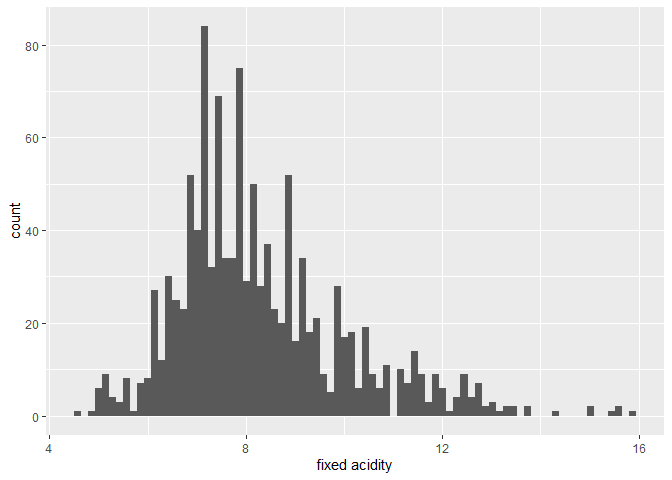
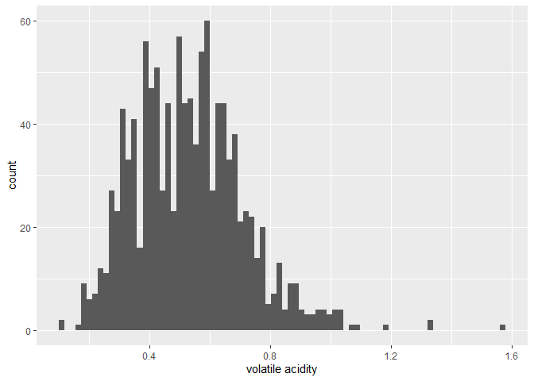
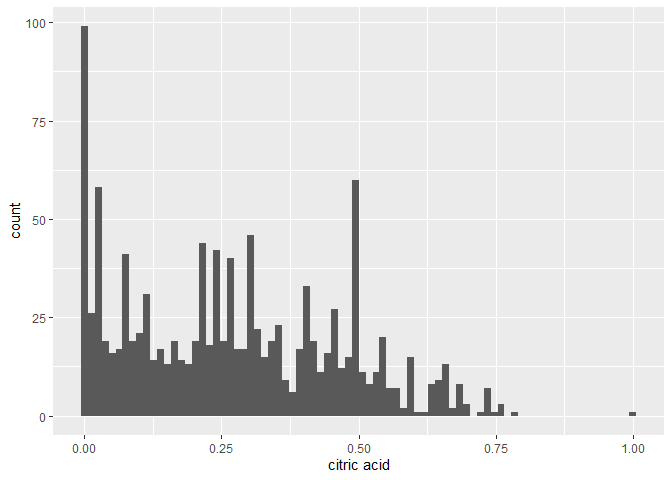
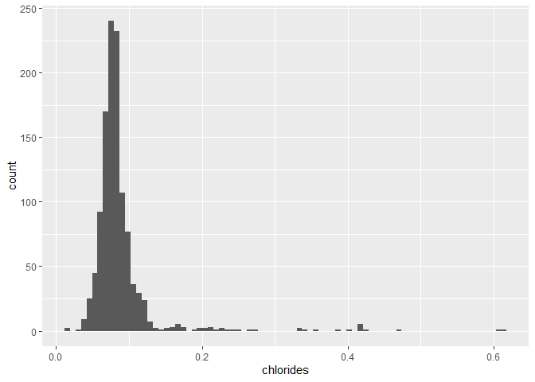
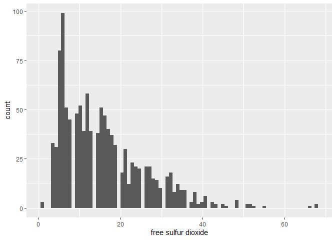
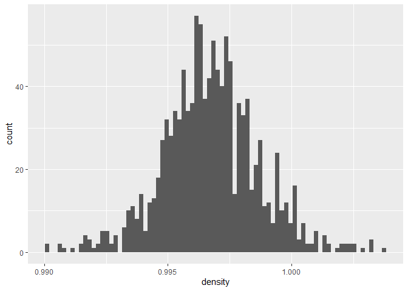
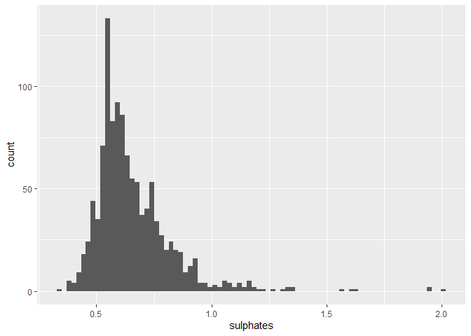
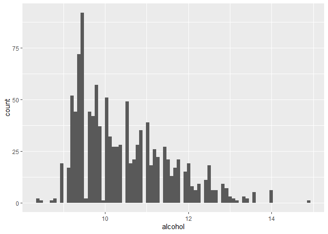

Final Project Data Memo
================
Carly Greutert

``` r
library(readxl)
library(tidyverse)
```

    ## -- Attaching packages --------------------------------------- tidyverse 1.3.1 --

    ## v ggplot2 3.3.5     v purrr   0.3.4
    ## v tibble  3.1.6     v dplyr   1.0.8
    ## v tidyr   1.2.0     v stringr 1.4.0
    ## v readr   2.1.1     v forcats 0.5.1

    ## -- Conflicts ------------------------------------------ tidyverse_conflicts() --
    ## x dplyr::filter() masks stats::filter()
    ## x dplyr::lag()    masks stats::lag()

``` r
wine <- read_csv('C:\\Program Files\\Git\\tmp\\131-finalproj\\WineQT.csv')
```

    ## Rows: 1143 Columns: 13

    ## -- Column specification --------------------------------------------------------
    ## Delimiter: ","
    ## dbl (13): fixed acidity, volatile acidity, citric acid, residual sugar, chlo...
    ## 
    ## i Use `spec()` to retrieve the full column specification for this data.
    ## i Specify the column types or set `show_col_types = FALSE` to quiet this message.

``` r
head(wine)
```

    ## # A tibble: 6 x 13
    ##   `fixed acidity` `volatile acidity` `citric acid` `residual sugar` chlorides
    ##             <dbl>              <dbl>         <dbl>            <dbl>     <dbl>
    ## 1             7.4               0.7           0                 1.9     0.076
    ## 2             7.8               0.88          0                 2.6     0.098
    ## 3             7.8               0.76          0.04              2.3     0.092
    ## 4            11.2               0.28          0.56              1.9     0.075
    ## 5             7.4               0.7           0                 1.9     0.076
    ## 6             7.4               0.66          0                 1.8     0.075
    ## # ... with 8 more variables: free sulfur dioxide <dbl>,
    ## #   total sulfur dioxide <dbl>, density <dbl>, pH <dbl>, sulphates <dbl>,
    ## #   alcohol <dbl>, quality <dbl>, Id <dbl>

``` r
nrow(wine)
```

    ## [1] 1143

``` r
is.null(wine)
```

    ## [1] FALSE

An Overview of my Dataset  
The dataset I chose from Kaggle & UCI Machine Learning Repository
(<https://www.kaggle.com/datasets/yasserh/wine-quality-dataset>)
predicts the wine quality of the red variants of the Portuguese “Vinho
Verde” wine. This dataset has 11 predictors (fixed acidity, volatile
acidity, citric acid, residual sugar, chlorides, free sulfur dioxide,
total sulfur dioxide, density, pH, sulphates, alcohol) based on
physicochemical tests to give a quality score between 0 and 10. Note
there is an ‘id’ variable that simply counts how many observations there
are but is not used in prediction. There are 1,142 observations/wines
that we draw from for our predictions. The predictor variables are all
numeric and can take any real, positive value. Quality, our response
variable, is a whole integer between 0 and 10. My initial observation is
that there are no missing values in my dataset, however, if a missing
value is discovered, I will likely omit that observation since there is
likely to be few and should not have a significant impact on predicting
quality.  
An Overview of my Research Questions  
I am interested in predicting the wine quality score. Some preliminary
research questions I am interested in answering: Which predictors are
useful in predicting quality? Which set of predictors produce the most
accurate results? Do all our predictors explain the quality score?  
These questions can be answered with a classification or regression
approach; however, I anticipate using a regression approach.

``` r
wine %>% ggplot(aes(x = `fixed acidity`))+ geom_histogram(bins = 80)
```

<!-- -->

``` r
wine %>% ggplot(aes(x = `volatile acidity`))+ geom_histogram(bins = 80)
```

<!-- -->

``` r
wine %>% ggplot(aes(x = `citric acid`))+ geom_histogram(bins = 80)
```

<!-- -->

``` r
wine %>% ggplot(aes(x = `residual sugar`))+ geom_histogram(bins = 80)
```

<!-- -->

``` r
wine %>% ggplot(aes(x = chlorides))+ geom_histogram(bins = 80)
```

<!-- -->

``` r
wine %>% ggplot(aes(x = `free sulfur dioxide`))+ geom_histogram(bins = 80)
```

<!-- -->

``` r
wine %>% ggplot(aes(x = `total sulfur dioxide`))+ geom_histogram(bins = 80)
```

<!-- -->

``` r
wine %>% ggplot(aes(x = density))+ geom_histogram(bins = 80)
```

<!-- -->

``` r
wine %>% ggplot(aes(x = pH))+ geom_histogram(bins = 80)
```

<!-- -->

``` r
wine %>% ggplot(aes(x = sulphates))+ geom_histogram(bins = 80)
```

<!-- -->

``` r
wine %>% ggplot(aes(x = alcohol))+ geom_histogram(bins = 80)
```

<!-- -->

I think fixed acidity and total sulfur dioxide will be especially useful
since there is more of a spread of values. The goal of my model is a
combination of descriptive and predictive because I want to be able to
explain why certain variables impact quality differently.  
My Proposed Project Timeline Weeks 1-2: Finding and Uploading Data Set  
Weeks 3-4: Tidy Data and Exploratory Data Analysis  
Weeks 5-8: Write descriptive analyses and create/run models  
Weeks 9-10: Compile and Edit into final draft
