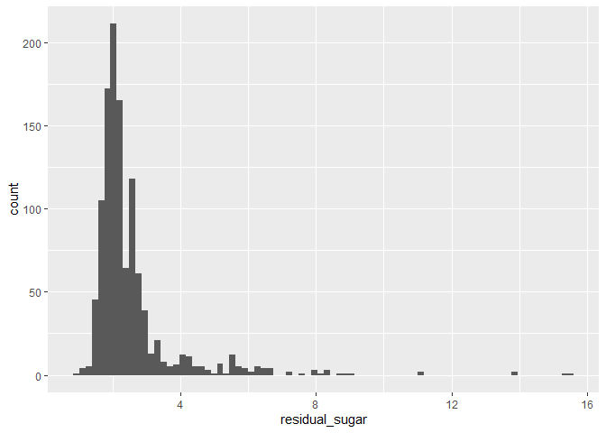
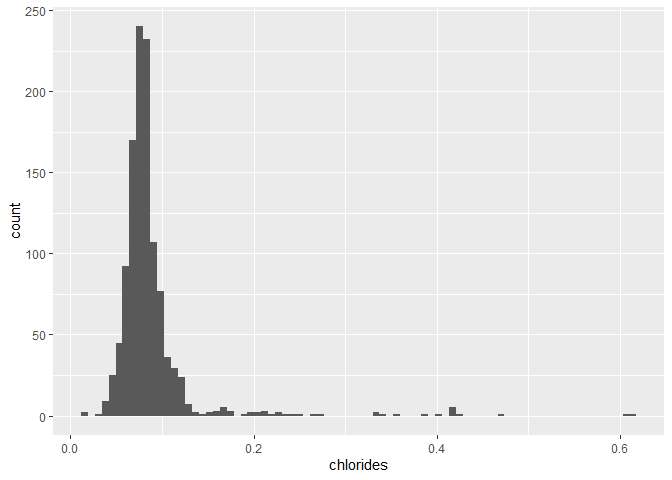
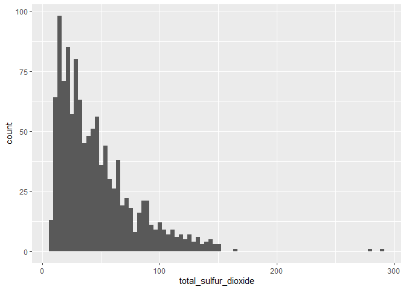
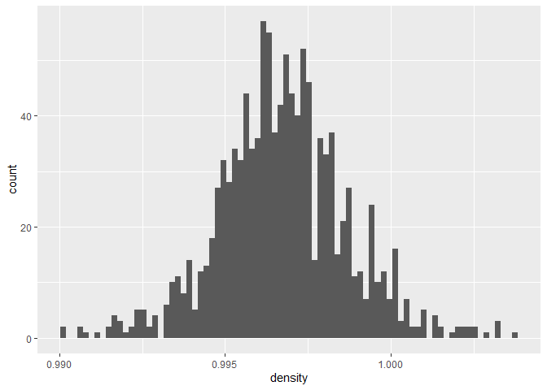
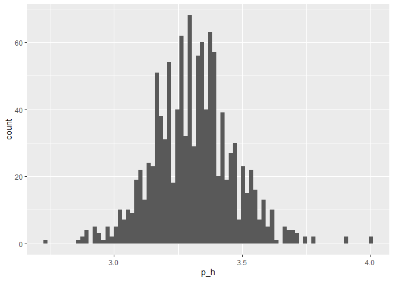
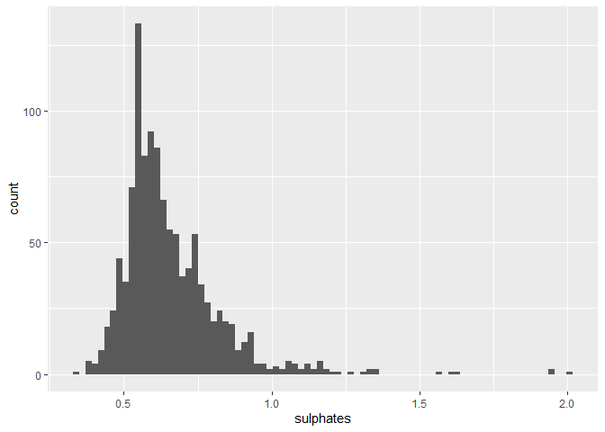
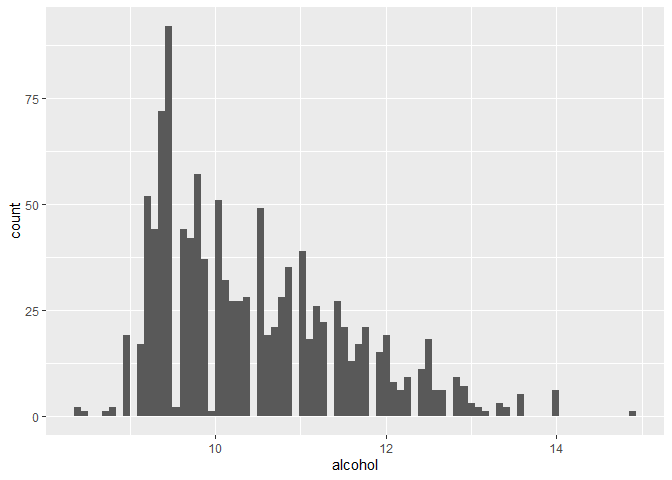

Final Project
================
Carly Greutert

# Table of Contents

# Introduction

-   An introduction section: Describes the data, the research questions,
    provides any background readers need to understand your project,
    etc.

The dataset I chose from Kaggle & UCI Machine Learning Repository
(<https://www.kaggle.com/datasets/yasserh/wine-quality-dataset>)
predicts the wine quality of the red variants of the Portuguese “Vinho
Verde” wine.

## An Overview of the Data Set

This dataset has 11 predictors (fixed acidity, volatile acidity, citric
acid, residual sugar, chlorides, free sulfur dioxide, total sulfur
dioxide, density, pH, sulphates, alcohol) based on physicochemical tests
to give a quality score between 0 and 10. Note there is an ‘id’ variable
that simply counts how many observations there are but is not used in
prediction. There are 1,142 observations/wines that we draw from for our
predictions. The predictor variables are all numeric and can take any
real, positive value. Quality, our response variable, is a whole integer
between 0 and 10. There are no missing values in my dataset, so all
observations are used for the model.

## Loading and Cleaning Data

``` r
wine <- read_csv('C:\\Program Files\\Git\\tmp\\131-finalproj\\WineQT.csv')
```

    ## Rows: 1143 Columns: 13
    ## -- Column specification --------------------------------------------------------
    ## Delimiter: ","
    ## dbl (13): fixed acidity, volatile acidity, citric acid, residual sugar, chlo...
    ## 
    ## i Use `spec()` to retrieve the full column specification for this data.
    ## i Specify the column types or set `show_col_types = FALSE` to quiet this message.

``` r
wine <- wine %>% clean_names()
head(wine)
```

    ## # A tibble: 6 x 13
    ##   fixed_acidity volatile_acidity citric_acid residual_sugar chlorides
    ##           <dbl>            <dbl>       <dbl>          <dbl>     <dbl>
    ## 1           7.4             0.7         0               1.9     0.076
    ## 2           7.8             0.88        0               2.6     0.098
    ## 3           7.8             0.76        0.04            2.3     0.092
    ## 4          11.2             0.28        0.56            1.9     0.075
    ## 5           7.4             0.7         0               1.9     0.076
    ## 6           7.4             0.66        0               1.8     0.075
    ## # ... with 8 more variables: free_sulfur_dioxide <dbl>,
    ## #   total_sulfur_dioxide <dbl>, density <dbl>, p_h <dbl>, sulphates <dbl>,
    ## #   alcohol <dbl>, quality <dbl>, id <dbl>

``` r
nrow(wine)
```

    ## [1] 1143

``` r
is.null(wine)
```

    ## [1] FALSE

An Overview of my Research Questions  
I am interested in predicting the wine quality score. Some preliminary
research questions I am interested in answering: Which predictors are
useful in predicting quality? Which set of predictors produce the most
accurate results? Do all our predictors explain the quality score?  
These questions can be answered with a classification or regression
approach; however, I anticipate using a regression approach.

# Exploratory Data Analysis (EDA)

-   A section for exploratory data analysis: This should contain at
    least 3 to 5 visualizations and/or tables and their
    interpretation/discussion. At minimum your group should create a
    univariate visualization of the outcome(s), a bi-variate or
    multivariate visualization of the relationship(s) between the
    outcome and select predictors, etc. Part of an EDA involves asking
    questions about your data and exploring your data to find the
    answers.

## Univariate Analysis

``` r
wine %>% ggplot(aes(x = fixed_acidity))+ geom_histogram(bins = 80)
```

<!-- -->

``` r
wine %>% ggplot(aes(x = volatile_acidity))+ geom_histogram(bins = 80)
```

<!-- -->

``` r
wine %>% ggplot(aes(x = citric_acid))+ geom_histogram(bins = 80)
```

<!-- -->

``` r
wine %>% ggplot(aes(x = residual_sugar))+ geom_histogram(bins = 80)
```

<!-- -->

``` r
wine %>% ggplot(aes(x = chlorides))+ geom_histogram(bins = 80)
```

<!-- -->

``` r
wine %>% ggplot(aes(x = free_sulfur_dioxide))+ geom_histogram(bins = 80)
```

<!-- -->

``` r
wine %>% ggplot(aes(x = total_sulfur_dioxide))+ geom_histogram(bins = 80)
```

<!-- -->

``` r
wine %>% ggplot(aes(x = density))+ geom_histogram(bins = 80)
```

<!-- -->

``` r
wine %>% ggplot(aes(x = p_h))+ geom_histogram(bins = 80)
```

<!-- -->

``` r
wine %>% ggplot(aes(x = sulphates))+ geom_histogram(bins = 80)
```

<!-- -->

``` r
wine %>% ggplot(aes(x = alcohol))+ geom_histogram(bins = 80)
```

<!-- -->

I think fixed acidity and total sulfur dioxide will be especially useful
since there is more of a spread of values. The goal of my model is a
combination of descriptive and predictive because I want to be able to
explain why certain variables impact quality differently.

# Cross Validation

-   A section discussing data splitting and cross-validation: Describe
    your process of splitting data into training, test, and/or
    validation sets. Describe the process of cross-validation.

# Model Fitting

-   A section discussing model fitting: Describe the types of models you
    fit, their parameter values, and the results.

# Model Selection and Performance

-   Model selection and performance: A table and/or graph describing the
    performance of your best-fitting model on testing data. Describe
    your best-fitting model however you choose, and the quality of its
    predictions, etc.

# Conclusion

-   A conclusion section: Discusses the outcome(s) of models you fit.
    Which models performed well, which performed poorly? Were you
    surprised by model performance? Next steps? General conclusions?
