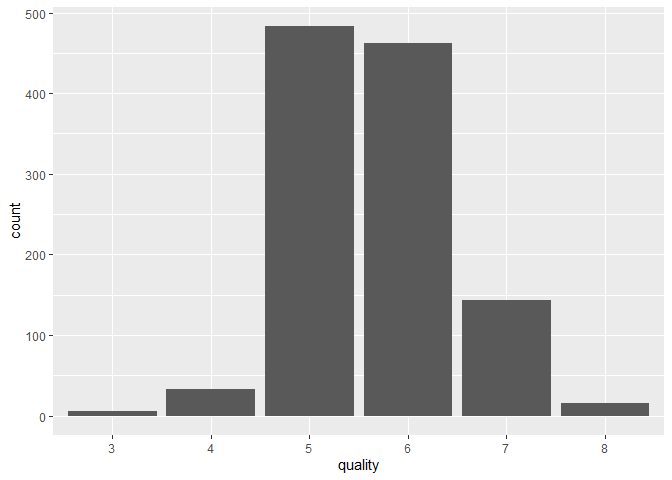
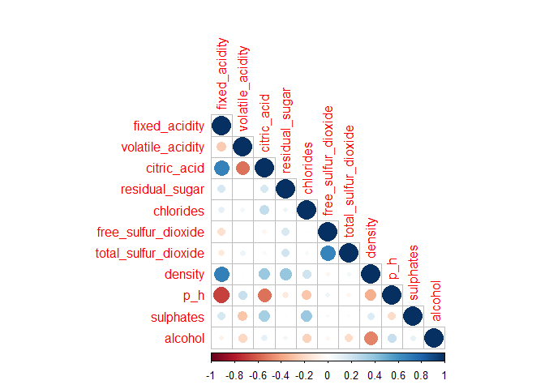
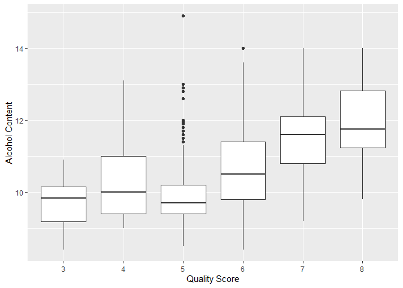
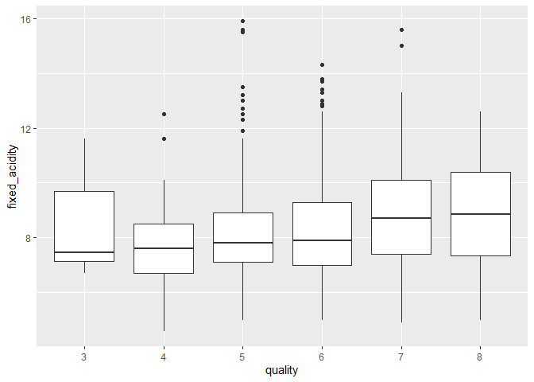
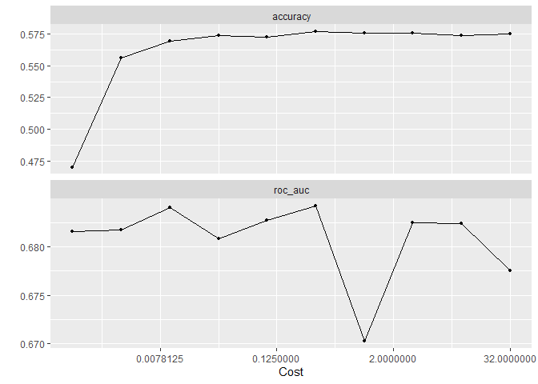
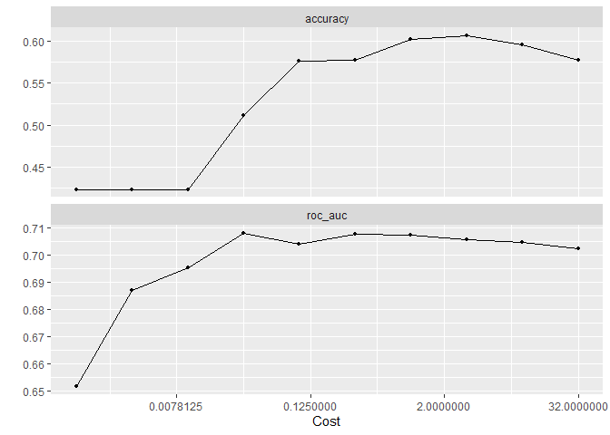
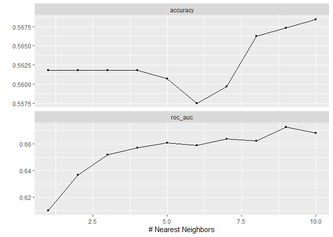
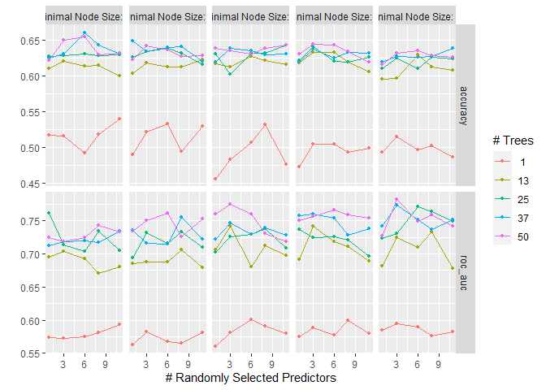
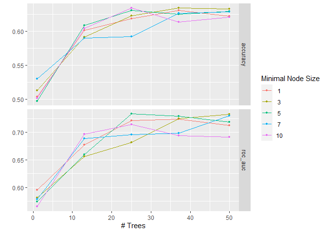
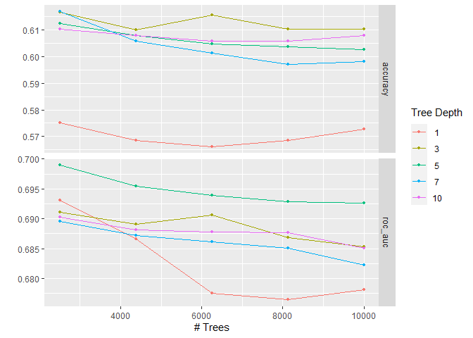

Final Project
================
Carly Greutert

-   [Introduction](#introduction)
    -   [Loading and Cleaning Data](#loading-and-cleaning-data)
    -   [An Overview of the Data Set](#an-overview-of-the-data-set)
    -   [Exploratory Research
        Questions](#exploratory-research-questions)
-   [Exploratory Data Analysis (EDA)](#exploratory-data-analysis-eda)
    -   [Predictor Summary Statistics](#predictor-summary-statistics)
    -   [Univariate Analysis](#univariate-analysis)
    -   [Bivariate Analysis](#bivariate-analysis)
-   [Cross Validation](#cross-validation)
-   [Model Fitting](#model-fitting)
    -   [Naive Bayes Model](#naive-bayes-model)
    -   [Support Vector Machine (SVM) with Linear Kernel
        Model](#support-vector-machine-svm-with-linear-kernel-model)
    -   [SVM with Non-Linear Kernel
        Model](#svm-with-non-linear-kernel-model)
    -   [K NNearest Neighbors Model](#k-nnearest-neighbors-model)
    -   [Random Forest Model](#random-forest-model)
    -   [Bagged Model](#bagged-model)
    -   [Boosted Tree Model](#boosted-tree-model)
-   [Model Selection and Performance](#model-selection-and-performance)
-   [Conclusion](#conclusion)

# Introduction

Across age groups and borders, the grape-derived delicacy, wine, has
been enjoyed (responsibly) by several, but what makes a specific wine
“good” or “bad”? Wine enthusiasts often rely on reviews by connoisseurs
and other ‘expert’ groups who classify the quality of wine before they
choose from an overwhelming selection. The quality score given by
experts is mostly based on the taster’s experience, which can be
incredibly subjective. I seek to use objective characteristics of wine
to predict its quality score. The data set I will be working with for
this project was originally created by the UCI Machine Learning
Repository and published by Kaggle
(<https://www.kaggle.com/datasets/yasserh/wine-quality-dataset>). The
data collected describes the wine quality of the red and white variants
of the north west located Portuguese “Vinho Verde” wine using a quality
scale from 1 to 10.

## Loading and Cleaning Data

``` r
wine <- read_csv('C:\\Program Files\\Git\\tmp\\131-finalproj\\WineQT.csv')
```

    ## Rows: 1143 Columns: 13
    ## -- Column specification --------------------------------------------------------
    ## Delimiter: ","
    ## dbl (13): fixed acidity, volatile acidity, citric acid, residual sugar, chlo...
    ## 
    ## i Use `spec()` to retrieve the full column specification for this data.
    ## i Specify the column types or set `show_col_types = FALSE` to quiet this message.

``` r
wine <- wine %>% clean_names()
wine <- wine %>% select(-id)
wine$quality <- as.factor(wine$quality)
head(wine)
```

    ## # A tibble: 6 x 12
    ##   fixed_acidity volatile_acidity citric_acid residual_sugar chlorides
    ##           <dbl>            <dbl>       <dbl>          <dbl>     <dbl>
    ## 1           7.4             0.7         0               1.9     0.076
    ## 2           7.8             0.88        0               2.6     0.098
    ## 3           7.8             0.76        0.04            2.3     0.092
    ## 4          11.2             0.28        0.56            1.9     0.075
    ## 5           7.4             0.7         0               1.9     0.076
    ## 6           7.4             0.66        0               1.8     0.075
    ## # ... with 7 more variables: free_sulfur_dioxide <dbl>,
    ## #   total_sulfur_dioxide <dbl>, density <dbl>, p_h <dbl>, sulphates <dbl>,
    ## #   alcohol <dbl>, quality <fct>

``` r
nrow(wine)
```

    ## [1] 1143

``` r
is.null(wine)
```

    ## [1] FALSE

## An Overview of the Data Set

This data set has 1143 observations and 11 predictors (fixed acidity,
volatile acidity, citric acid, residual sugar, chlorides, free sulfur
dioxide, total sulfur dioxide, density, pH, sulphates, alcohol) based on
physicochemical tests to give a quality score between 0 and 10. Note
there is an ‘id’ variable that simply counts the number of observations
there are. Since this is not relevant to our precdiction, I elected to
remove it from the data set. The predictor variables are all numeric and
can take any real, positive value. Quality, our response variable, is a
whole integer between 0 and 10. Note that I converted ‘quality’ into a
factor to reflect that it is a categorical value, not numeric. There are
no missing values in my data set, so all observations are used for the
model.

## Exploratory Research Questions

I am interested in predicting the wine quality score. Some questions I
hope to explore related to this prediction include the following:

-   Which predictors are most important in predicting quality?  
-   Which set of predictors produce the most accurate results?  
-   Are all of our predictors relevant?  
-   Do there exist any collinear relationships between predictors
    influencing the data?  
-   Which model/approach yields the highest accuracy of prediction?

I intend to use a classification model, as opposed to a regression
approach.

# Exploratory Data Analysis (EDA)

## Predictor Summary Statistics

``` r
summary(wine)
```

    ##  fixed_acidity    volatile_acidity  citric_acid     residual_sugar  
    ##  Min.   : 4.600   Min.   :0.1200   Min.   :0.0000   Min.   : 0.900  
    ##  1st Qu.: 7.100   1st Qu.:0.3925   1st Qu.:0.0900   1st Qu.: 1.900  
    ##  Median : 7.900   Median :0.5200   Median :0.2500   Median : 2.200  
    ##  Mean   : 8.311   Mean   :0.5313   Mean   :0.2684   Mean   : 2.532  
    ##  3rd Qu.: 9.100   3rd Qu.:0.6400   3rd Qu.:0.4200   3rd Qu.: 2.600  
    ##  Max.   :15.900   Max.   :1.5800   Max.   :1.0000   Max.   :15.500  
    ##    chlorides       free_sulfur_dioxide total_sulfur_dioxide    density      
    ##  Min.   :0.01200   Min.   : 1.00       Min.   :  6.00       Min.   :0.9901  
    ##  1st Qu.:0.07000   1st Qu.: 7.00       1st Qu.: 21.00       1st Qu.:0.9956  
    ##  Median :0.07900   Median :13.00       Median : 37.00       Median :0.9967  
    ##  Mean   :0.08693   Mean   :15.62       Mean   : 45.91       Mean   :0.9967  
    ##  3rd Qu.:0.09000   3rd Qu.:21.00       3rd Qu.: 61.00       3rd Qu.:0.9978  
    ##  Max.   :0.61100   Max.   :68.00       Max.   :289.00       Max.   :1.0037  
    ##       p_h          sulphates         alcohol      quality
    ##  Min.   :2.740   Min.   :0.3300   Min.   : 8.40   3:  6  
    ##  1st Qu.:3.205   1st Qu.:0.5500   1st Qu.: 9.50   4: 33  
    ##  Median :3.310   Median :0.6200   Median :10.20   5:483  
    ##  Mean   :3.311   Mean   :0.6577   Mean   :10.44   6:462  
    ##  3rd Qu.:3.400   3rd Qu.:0.7300   3rd Qu.:11.10   7:143  
    ##  Max.   :4.010   Max.   :2.0000   Max.   :14.90   8: 16

## Univariate Analysis

``` r
wine %>% ggplot(aes(x = quality))+ geom_bar(stat = "count")
```

<!-- -->

It appears that this dataset only consists of wine with a quality
between 3 and 8. This shows we just took an average sample of wine,
there are not really outliers. Furthermore, the quality scores appear to
follow a normal distribution.

##Multivariate Analysis

``` r
wine %>% select(where(is.numeric)) %>% cor() %>% corrplot(type="lower")
```

<!-- --> It
appears the following pairings are highly correlated: fixed
acidity/citric acid, volatile acidity/citric acid, fixed
acidity/density, fixed acidity/pH, citric acid/pH, free sulfur
dioxide/total sulfur dioxide, and density/alcohol.

## Bivariate Analysis

``` r
wine %>% 
  ggplot(aes(x = alcohol, y = quality)) +
  geom_boxplot() +
  xlab("Alcohol Content") +
  ylab("Quality Score") +
  coord_flip()
```

<!-- --> My
initial assumption is the higher the alcohol content, the higher the
quality score.

``` r
wine %>% 
  ggplot(aes(x = quality, y = fixed_acidity)) +
  geom_boxplot()
```

<!-- --> My
initial assumption is that fixed acidity has some outliers when the
quality score is 5 or 6, but fixed acidity does not greatly change its
quality score.

# Cross Validation

``` r
set.seed(1212)
wine_split <- initial_split(wine, prop = 0.80, strata = 'quality')
wine_train <- training(wine_split)
wine_test <- testing(wine_split)
dim(wine_train)
```

    ## [1] 913  12

``` r
dim(wine_test)
```

    ## [1] 230  12

``` r
wine_folds <- vfold_cv(wine_train, strata = quality, v = 5)
wine_recipe <- recipe(quality ~ fixed_acidity + volatile_acidity + citric_acid + residual_sugar + chlorides + free_sulfur_dioxide + total_sulfur_dioxide + density + p_h + sulphates + alcohol, wine_train) %>% 
                  step_center(all_predictors()) %>% 
                  step_scale(all_predictors())
```

The first step to building our model is setting our seed to save
results. Then, I split the data into a testing and training set, with
the proportion set to 0.80, stratifying on the quality variable. Then, I
checked the dimensions of each data set to verify it was split
correctly. I decided to employ cross-validation by folding the data into
5 partitions. I decided not to do 10 splits since there are only 1143
observations and I do not want to overfit the data. Then, I set up a
recipe to predict to quality and centered and scaled all predictors.

# Model Fitting

Now that we’ve split our data and set up our recipe, I will fit seven
different types of models to predict quality at the highest degree of
accuracy.

## Naive Bayes Model

``` r
naive_mod <- 
  naive_Bayes()%>%
    set_mode("classification") %>% 
    set_engine("klaR") %>%
    set_args(usekernel = FALSE)

naive_wf <- workflow() %>% 
  add_model(naive_mod) %>% 
  add_recipe(wine_recipe)

naive_fit <- fit_resamples(naive_wf, wine_folds)

collect_metrics(naive_fit)
```

    ## # A tibble: 2 x 6
    ##   .metric  .estimator  mean     n std_err .config             
    ##   <chr>    <chr>      <dbl> <int>   <dbl> <chr>               
    ## 1 accuracy multiclass 0.505     5  0.0134 Preprocessor1_Model1
    ## 2 roc_auc  hand_till  0.678     5  0.0262 Preprocessor1_Model1

The first model I am fitting is a Naive Bayes model. I fit it to the
resamples and the roc_auc value is 0.677586 and the accuracy value is
0.5050257 with standard errors of 0.013 and 0.026, respectively.

## Support Vector Machine (SVM) with Linear Kernel Model

``` r
svm_linear_mod <- svm_poly(degree = 1) %>%
  set_mode("classification") %>%
  set_engine("kernlab", scaled = FALSE)

svm_linear_wf <- workflow() %>%
  add_model(svm_linear_mod %>% set_args(cost = tune())) %>%
  add_recipe(wine_recipe)

svm_grid <- grid_regular(cost(), levels = 10)

svm_tune <- tune_grid(
  svm_linear_wf, 
  resamples = wine_folds, 
  grid = svm_grid
)

autoplot(svm_tune)
```

<!-- -->

``` r
show_best(svm_tune)
```

    ## # A tibble: 5 x 7
    ##       cost .metric .estimator  mean     n std_err .config              
    ##      <dbl> <chr>   <chr>      <dbl> <int>   <dbl> <chr>                
    ## 1  0.315   roc_auc hand_till  0.684     5  0.0188 Preprocessor1_Model06
    ## 2  0.00984 roc_auc hand_till  0.684     5  0.0191 Preprocessor1_Model03
    ## 3  0.0992  roc_auc hand_till  0.683     5  0.0188 Preprocessor1_Model05
    ## 4  3.17    roc_auc hand_till  0.683     5  0.0250 Preprocessor1_Model08
    ## 5 10.1     roc_auc hand_till  0.682     5  0.0283 Preprocessor1_Model09

The next model I decided to fit is a Support Vector Classifier with
Linear Kernel. I decided to set up a grid to tune the cost parameter. It
looks like the higher the cost, the higher accuracy. However, in the
case of the roc_auc values, its performance is more varied, with it
peaking at a lower cost, but returning again after reaching a value of
2. It appears that the best cost is 0.31498, yielding a value of
0.6842662 and a standard error of 0.01876.

## SVM with Non-Linear Kernel Model

``` r
svm_nonlinear_mod <- svm_rbf() %>%
  set_mode("classification") %>%
  set_engine("kernlab")

svm_nonlinear_wf <- workflow() %>%
  add_model(svm_nonlinear_mod %>% set_args(cost = tune())) %>%
  add_recipe(wine_recipe)

svm_gridn <- grid_regular(cost(), levels = 10)

svm_tunen <- tune_grid(
  svm_nonlinear_wf, 
  resamples = wine_folds, 
  grid = svm_gridn
)

autoplot(svm_tunen)
```

<!-- -->

``` r
show_best(svm_tunen)
```

    ## # A tibble: 5 x 7
    ##      cost .metric .estimator  mean     n std_err .config              
    ##     <dbl> <chr>   <chr>      <dbl> <int>   <dbl> <chr>                
    ## 1  0.0312 roc_auc hand_till  0.708     5  0.0147 Preprocessor1_Model04
    ## 2  0.315  roc_auc hand_till  0.708     5  0.0210 Preprocessor1_Model06
    ## 3  1      roc_auc hand_till  0.707     5  0.0220 Preprocessor1_Model07
    ## 4  3.17   roc_auc hand_till  0.706     5  0.0227 Preprocessor1_Model08
    ## 5 10.1    roc_auc hand_till  0.705     5  0.0228 Preprocessor1_Model09

I decided to see how the performance changes with a non-linear kernel
for the SVM model. I am still tuning with the cost parameter. Similar to
the linear kernel, as cost increases, accuracy does as well. However, it
differs in the roc_auc case since as cost increases, the roc_auc
increases as well. It appears that the best performing model has a cost
value of 10.07936, yielding a roc_auc of 0.7089461 and a standard error
of 0.02183. This is slightly better than the linear case, but I will fit
more models with a different approach.

## K NNearest Neighbors Model

``` r
knn_mod <- 
  nearest_neighbor(neighbors = tune())%>%
    set_mode("classification") %>% 
    set_engine("kknn")

knn_wf <- workflow() %>% 
  add_model(knn_mod) %>% 
  add_recipe(wine_recipe)

knn_grid <- grid_regular(neighbors(), levels = 10)

knn_tune <- tune_grid(
  knn_wf, 
  resamples = wine_folds, 
  grid = knn_grid
)

autoplot(knn_tune)
```

<!-- -->

``` r
show_best(knn_tune)
```

    ## # A tibble: 5 x 7
    ##   neighbors .metric .estimator  mean     n std_err .config              
    ##       <int> <chr>   <chr>      <dbl> <int>   <dbl> <chr>                
    ## 1         9 roc_auc hand_till  0.673     5  0.0209 Preprocessor1_Model09
    ## 2        10 roc_auc hand_till  0.668     5  0.0206 Preprocessor1_Model10
    ## 3         7 roc_auc hand_till  0.664     5  0.0199 Preprocessor1_Model07
    ## 4         8 roc_auc hand_till  0.662     5  0.0197 Preprocessor1_Model08
    ## 5         5 roc_auc hand_till  0.661     5  0.0201 Preprocessor1_Model05

For this model, I decided to employ the K-Nearest Neighbors approach.
The parameter I decided to tune was the number of nearest neighbors. In
the accuracy case, the value stays pretty steady between 0 and 6 nearest
neighbors, then drops before increasing quickly. The roc_auc case has
more of a steady increase with a soft curve upward. The best tuned model
has 9 neighbors with an roc_auc value of 0.6726859 and standard error of
0.0209.

## Random Forest Model

``` r
forest_model <- 
  rand_forest(trees = tune(),
              min_n = tune(),
              mtry = tune()) %>%
              set_mode("classification") %>% 
              set_engine("ranger", importance = 'impurity')

forest_wf <- workflow() %>% 
  add_model(forest_model) %>% 
  add_recipe(wine_recipe)

param_gridf <- grid_regular(min_n(range = c(1,10)), trees(range = c(1,50)), mtry(range = c(1,11)), levels= 5)

tune_resf <- tune_grid(
  forest_wf, 
  resamples = wine_folds, 
  grid = param_gridf
)

autoplot(tune_resf)
```

<!-- -->

``` r
show_best(tune_resf)
```

    ## # A tibble: 5 x 9
    ##    mtry trees min_n .metric .estimator  mean     n std_err .config              
    ##   <int> <int> <int> <chr>   <chr>      <dbl> <int>   <dbl> <chr>                
    ## 1     3    50    10 roc_auc hand_till  0.782     5 0.0204  Preprocessor1_Model0~
    ## 2     3    50     5 roc_auc hand_till  0.774     5 0.0123  Preprocessor1_Model0~
    ## 3     3    37    10 roc_auc hand_till  0.774     5 0.00537 Preprocessor1_Model0~
    ## 4     6    25    10 roc_auc hand_till  0.771     5 0.00923 Preprocessor1_Model0~
    ## 5     6    50     7 roc_auc hand_till  0.766     5 0.00897 Preprocessor1_Model0~

Now, I will fit a forest model to the training data. The parameters I am
tuning are the minimal node size (min_n), the number of predictors in
each fold (mtry), and the number of trees. It looks like the higher
number of trees, the better performance for roc_auc and accuracy. In
both cases, the fewer number of predictors (mtry), the better. For
minimal node size, it varies without much change in performance, but it
appears the higher number the better. The best forest model has a 3 mtry
value, 50 trees, and 10 minimal nodes to yield a roc_auc value of
0.7837693 and a standard error of 0.01459.

## Bagged Model

``` r
bagging_mod <- rand_forest(mtry = 11, min_n = tune(), trees = tune()) %>%
  set_engine("randomForest", importance = TRUE) %>%
  set_mode("classification")

bagging_wf <- workflow() %>%
  add_model(bagging_mod) %>%
  add_recipe(wine_recipe)

param_gridbag <- grid_regular(min_n(range = c(1,10)), trees(range = c(1,50)), levels= 5)

tune_bag <- tune_grid(
  bagging_wf, 
  resamples = wine_folds, 
  grid = param_gridbag
)

autoplot(tune_bag)
```

<!-- -->

``` r
show_best(tune_bag)
```

    ## # A tibble: 5 x 8
    ##   trees min_n .metric .estimator  mean     n std_err .config              
    ##   <int> <int> <chr>   <chr>      <dbl> <int>   <dbl> <chr>                
    ## 1    25     5 roc_auc hand_till  0.734     5  0.0323 Preprocessor1_Model13
    ## 2    50     3 roc_auc hand_till  0.733     5  0.0221 Preprocessor1_Model22
    ## 3    50     7 roc_auc hand_till  0.730     5  0.0309 Preprocessor1_Model24
    ## 4    37     5 roc_auc hand_till  0.729     5  0.0365 Preprocessor1_Model18
    ## 5    37     3 roc_auc hand_till  0.725     5  0.0152 Preprocessor1_Model17

I decided to explore the bagged model more closely, despite it being
included in the forest model above. Note mtry is set to 11, since that
is the maximum number of predictors. Trees and min_n are still tuned,
though. It appears the higher number of trees, the better performance,
but the lower minimal node is better, excluding min_n = 1. The best
model has 50 trees and a minimal node of 3. It yields an roc_auc value
of 0.7171641 and an error of 0.02527, so it performed slightly worse
than the forest model.

## Boosted Tree Model

``` r
boost_mod <- boost_tree(trees = tune(), tree_depth = tune()) %>%
  set_engine("xgboost") %>%
  set_mode("classification")

boost_wf <- workflow() %>%
  add_model(boost_mod) %>%
  add_recipe(wine_recipe)

param_gridb <- grid_regular(tree_depth(range = c(1,10)), trees(range = c(2500,10000)), levels= 5)

tune_boost <- tune_grid(
  boost_wf, 
  resamples = wine_folds, 
  grid = param_gridb 
)

autoplot(tune_boost)
```

<!-- -->

``` r
show_best(tune_boost)
```

    ## # A tibble: 5 x 8
    ##   trees tree_depth .metric .estimator  mean     n std_err .config              
    ##   <int>      <int> <chr>   <chr>      <dbl> <int>   <dbl> <chr>                
    ## 1  2500          5 roc_auc hand_till  0.699     5 0.0103  Preprocessor1_Model11
    ## 2  4375          5 roc_auc hand_till  0.695     5 0.00998 Preprocessor1_Model12
    ## 3  6250          5 roc_auc hand_till  0.694     5 0.0102  Preprocessor1_Model13
    ## 4  2500          1 roc_auc hand_till  0.693     5 0.0123  Preprocessor1_Model01
    ## 5  8125          5 roc_auc hand_till  0.693     5 0.0105  Preprocessor1_Model14

The boosted tree model is the final one I decided to fit. I decided to
tune the number of trees, as well as tree depth. It looks like the lower
number of depth yields better performance, excluding tree depth = 1. The
higher number of trees yields a smaller performance. The best boosted
tree model has 2500 trees, a tree depth of 5, an roc_auc value of
0.6989, and a standard error of 0.010. This is a worse performance than
the normal forest model.

``` r
naive_acc <- collect_metrics(naive_fit)[2,]
boost_acc <- show_best(tune_bag, metric = "roc_auc")[1,]
bagging_acc <- show_best(tune_boost, metric = "roc_auc")[1,]
lsvm_acc <- show_best(svm_tune, metric = "roc_auc")[1,]
nlsvm_acc <- show_best(svm_tunen, metric = "roc_auc")[1,]
knn_acc <- show_best(knn_tune, metric = "roc_auc")[1,]
forest_acc <- show_best(tune_resf, metric = "roc_auc")[1,]

model_metrics <- bind_rows(naive_acc, lsvm_acc, nlsvm_acc, knn_acc, forest_acc, bagging_acc, boost_acc) %>% 
  mutate(.config = c("NB", "LSVM", "NLSVM", "KNN", "Forest", "Bagging", "Boost"))%>%
  tibble() %>%
  arrange(desc(mean))

model_metrics
```

    ## # A tibble: 7 x 12
    ##   .metric .estimator  mean     n std_err .config    cost neighbors  mtry trees
    ##   <chr>   <chr>      <dbl> <int>   <dbl> <chr>     <dbl>     <int> <int> <int>
    ## 1 roc_auc hand_till  0.782     5  0.0204 Forest  NA             NA     3    50
    ## 2 roc_auc hand_till  0.734     5  0.0323 Boost   NA             NA    NA    25
    ## 3 roc_auc hand_till  0.708     5  0.0147 NLSVM    0.0312        NA    NA    NA
    ## 4 roc_auc hand_till  0.699     5  0.0103 Bagging NA             NA    NA  2500
    ## 5 roc_auc hand_till  0.684     5  0.0188 LSVM     0.315         NA    NA    NA
    ## 6 roc_auc hand_till  0.678     5  0.0262 NB      NA             NA    NA    NA
    ## 7 roc_auc hand_till  0.673     5  0.0209 KNN     NA              9    NA    NA
    ## # ... with 2 more variables: min_n <int>, tree_depth <int>

# Model Selection and Performance

Our Forest model performed the best on the training data, given all the
models roc_auc values. Now, we will fit our forest model to the testing
data and see how it performs.

``` r
best_forest <- select_best(tune_resf, metric = "roc_auc")

forest_final_wf <- finalize_workflow(forest_wf, best_forest)

wf_final <- fit(forest_final_wf, data = wine_train)

augment(wf_final, new_data = wine_test) %>%
  roc_auc(quality, 3:8)
```

    ## # A tibble: 1 x 3
    ##   .metric .estimator .estimate
    ##   <chr>   <chr>          <dbl>
    ## 1 roc_auc hand_till      0.491

``` r
wf_final %>%
  pull_workflow_fit() %>%
  vip()
```

<!-- -->

After fitting our model to the testing data, it yielded an roc_auc value
of 0.4909294. From the variable importance plot, we see alcohol,
sulphates, and density were the most important and p_h, fixed_acidity,
and residual_sugar being the least important.

# Conclusion

It appears that the Forest, Non-Linear SVM, and bagging models performed
the best overall, and the Linear SVM, Naive Bayes, and K-Nearest
Neighbors models performing the worst overall. Our Forest model
performed significantly better on the training data though, with an
roc_auc value of 0.7837. Note the tuning parameter values are mtry = 3,
trees = 50, and min_n = 10. I was surprised that alcohol content was the
most important variable determining quality and that p_h was not as
important. I am also surprised my boosted tree model did not perform
better than my bagged model since our bagged model parameter mtry was
constant. My next steps would be to tune the model further and modify
the recipe to yield a higher value of accuracy. In order to better
predict quality, I would recommend going forward subsetting the quality
levels and determining why one level was predicted at a higher accuracy
than another.
